# opennebula-in-docker-experimental

## Installation

To install OpenNebula execute the following command:
```bash
make install --always-make
```

## Starting Up

To start OpenNebula execute the following command:
```bash
make start --always-make --ignore-errors
```

> `--ignore-errors` flag was added because `python3 systemctl3.py start opennebula` fails, but OpenNebula works fine

## Generating a new SSH key

Execute the following command to generate a new SSH key
```bash
ssh-keygen -t ed25519 -f ./vm-key
```
This key will be used to connect to the created VM


Get password and copy it
```bash
cat /var/lib/one/.one/one_auth | sed 's/^[^:]*://'
```

Open `https://localhost:2616` and login as `oneadmin` with copied password


Go to the `Settings` -> `Security`

Copy created SSH key from vm-key.pub and paste it to `SSH public key`

## Creating a VM

### Creating a new host

Go to `Infrastructure` -> `Hosts` -> `Create`  
Select Hypervisor - `KVM`  
Host - `localhost`

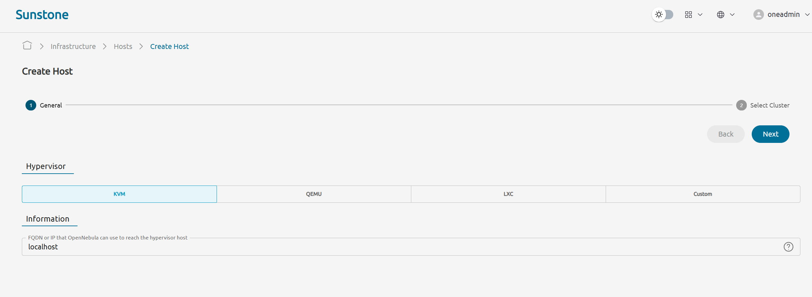
Click `Next` and select `default` cluster
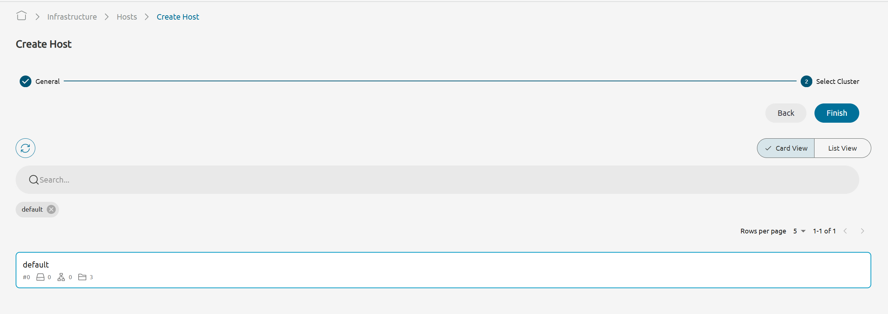

### Creating a new image

Go to `Infrastructure` -> `Storage` -> `Images` -> `Create`  
Specify the name (e.g. `Ubuntu 24.04 Server Image`)  
Type - `Operating system image`  
Path/Url - `https://cloud-images.ubuntu.com/releases/noble/release/ubuntu-24.04-server-cloudimg-amd64.img`  
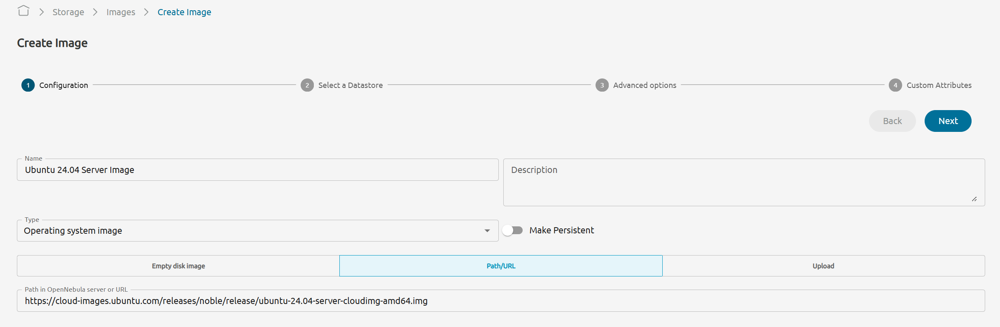
Click `Next` and select `default` datastore
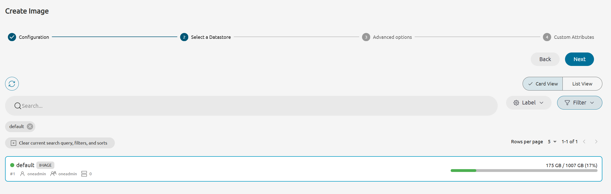
Now click `Next` -> `Finish` and wait for the image to be ready
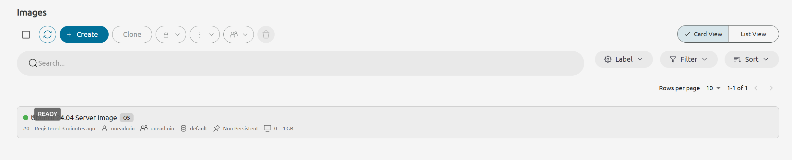

### Creating a virtual network

Go to `Networks` -> `Virtual networks` -> `Create`

Specify the name (e.g. `Private network`)
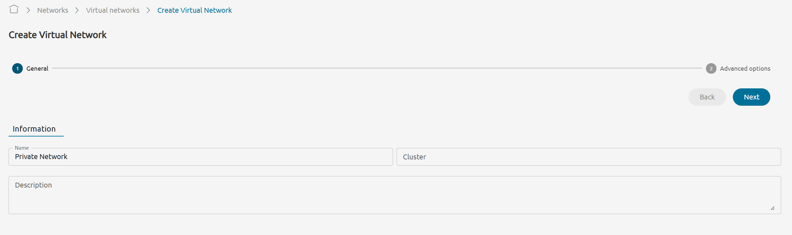
Click `Next`  
Select `Bridged` type in `Configuration` and enable `Use private host networking or a user-defined bridge`
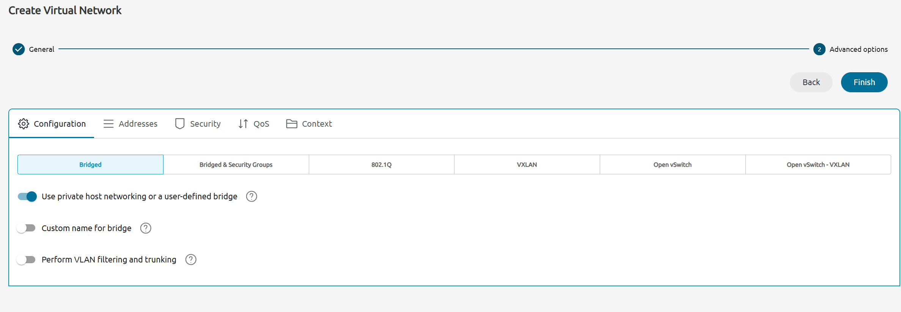


Switch to the `Addresses` tab -> click `Address Range`  
First IPv4 address - `192.168.1.100`
Size(count of addresses) - `20`
Click `Add`
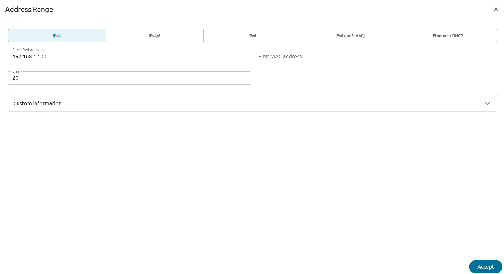

Switch to the `Context` tab  
Network address - `192.168.1.0`  
Gateway - `192.168.1.1`  
DNS - `8.8.8.8`  
Method - `static`  
Network mask - `255.255.255.0`  
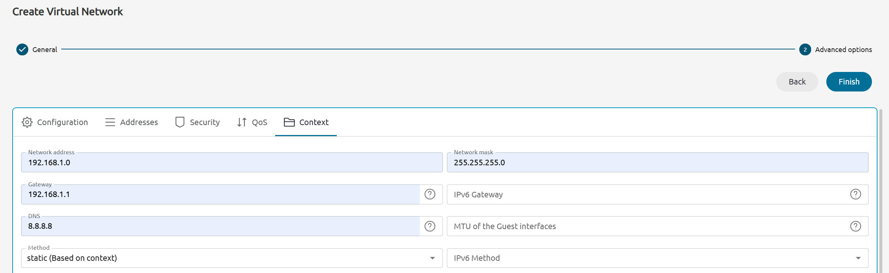
Custom Attributes -> `BRIDGE_TYPE` `linux`
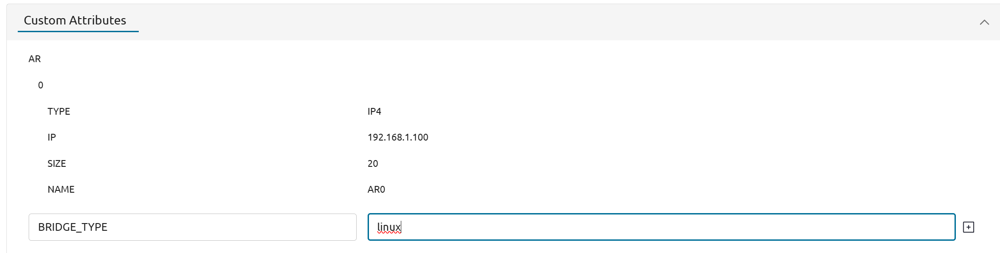
Click `Finish`

### Creating a VM template

Go to `Templates` -> `VM Templates` -> `Create`

Hypervisor - `KVM`  
Specify the name (e.g. `Ubuntu Server 24.04 Template`)  
Memory - `2 GB`
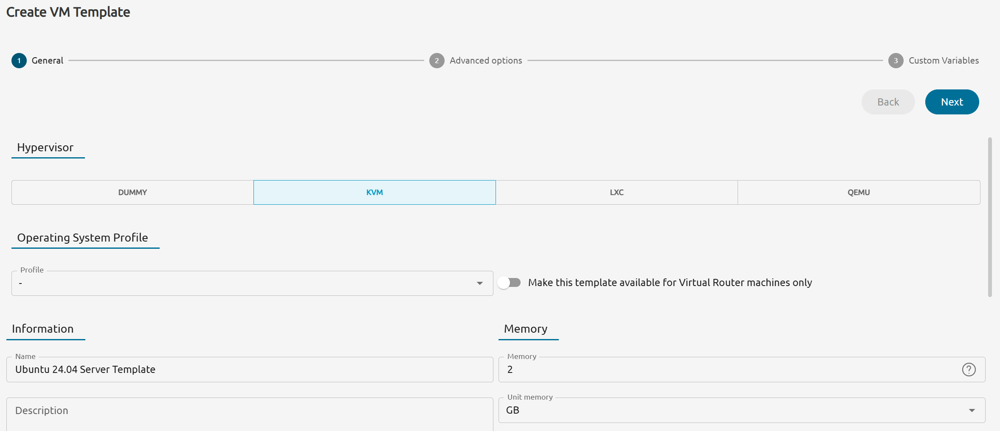

Physical CPU - `2`  
Virtual CPU - `2`
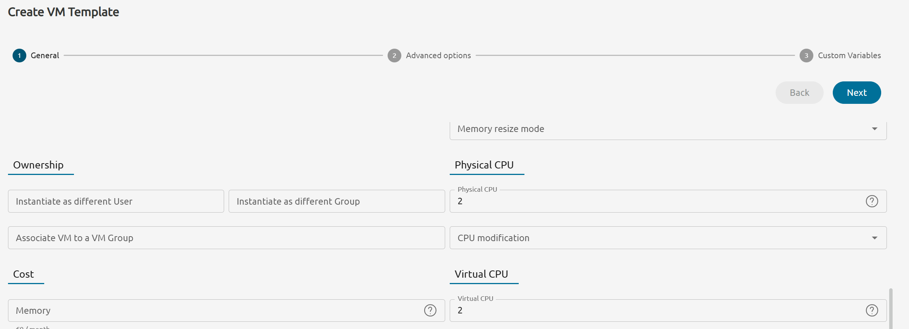
Click `Next`  
`Storage` -> `Attach disk` -> `Image`  
Select created image -> `Next` -> `Finish`
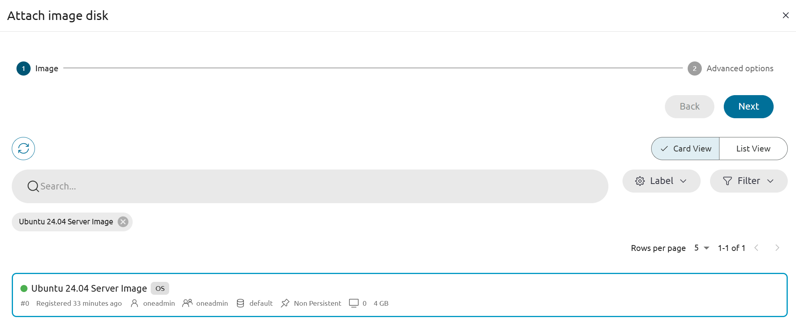

Switch to the `Network` tab -> `Attach NIC`
Switch to the `Select a network` and select created network
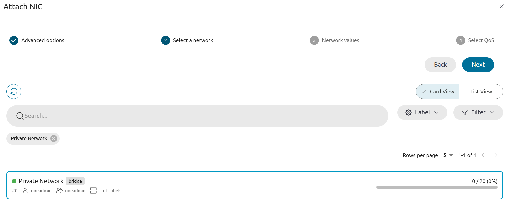
Click `Next` and `Finish`

Switch to the `OS&CPU` tab
Select both: DISK0 and NIC0

Click `Next` and `Finish`

